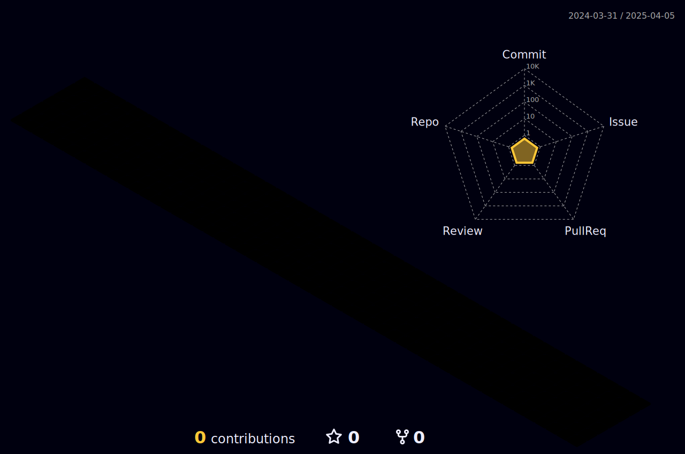

<h1 align="center">  </h1>

<picture decoding="async" loading="lazy">
  <source media="(prefers-color-scheme: light)" srcset="https://pixel-profile.vercel.app/api/github-stats?username=cnjimbo&screen_effect=false&background=linear-gradient(to%20bottom%20right%2C%20%2374dcc4%2C%20%234597e9)">
  <source media="(prefers-color-scheme: dark)" srcset="https://pixel-profile.vercel.app/api/github-stats?username=cnjimbo&screen_effect=true&background=linear-gradient(to%20bottom%20right%2C%20%235580eb%2C%20%232aeeff)">
  
</picture>

<!-- 个人资料徽标 -->

  &emsp;
  &emsp;
  &emsp;
  &emsp;
  &emsp;  
  &emsp;
  &emsp;
  
<!-- 访客数统计徽标 -->
  
 

:heart: Recommend

🧰 Tools:

&emsp;&emsp; 

<!-- Gif -->

  
  
  
  
  
  
  
  

<!-- just img -->

<table align="center">
  <tr>
    <td width="50%">
     
    </td>
    <td width="50%">
     
     
     
     
     
  

    </td>
  </tr>
</table>

<!-- GitHub Activity Graph -->
<table align="center">
  <tr>
    <td colspan="2">
      
    </td>
  </tr>
</table>

<!-- Wakatime Graph-->

  

### 为爱发电，如果我的工作帮助到了你，可以请我喝一杯咖啡☕️，鼓励我继续努力💪
[`Buy me a cup of coffee`](https://github.com/cnjimbo/sponsor)

[`爱发电`](https://afdian.net/a/cnjimbo)

## Sponsors

  

